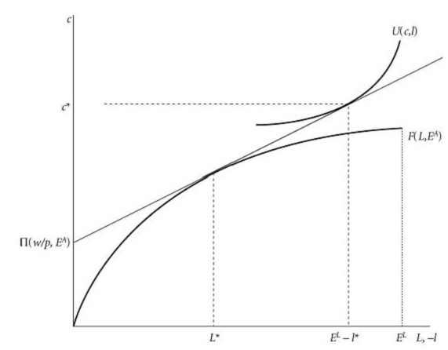
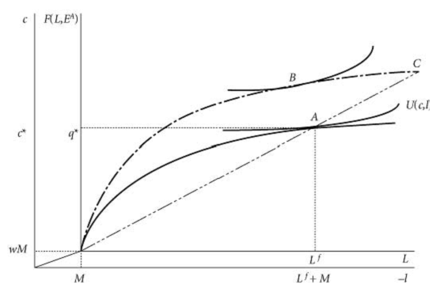

# Agricultural Household Model

## reference

* development microecoomics 
* lecture note1
* lecture note2

## Introduction
In developing countries, people who are farmer are very special. Because they earn at least part of their livelihood through work in their own enterprises(the land). At the same time, they also can consume a portion of their product(they grow crops, harvest them, sell them or eat them). We know that due to the unique feature of agriculture, household labour is often an important input into the production process of the farmer's production activity. Consequently, Consequently, individuals make simultaneous decisions about production (the level of output, the demand for factors, and the choice of technology) and consumption (labor supply and commodity demand). This mixture just describes common daily life of most families in developing countries and provides starting point (Agricultural Household Model) for our analysis.

## Baseline Model Overview
The canonical model of an agricultural household includes a utility function, defined over consumption by each member of the household (usually can be simplified by one or two members), and a budget constraint, which incorporates production on assets owned by the household. 

Consider a typical household with two household members whose aggregate utility is represented by a household utility function:

$$\max U({c_1},{c_2},{l_1},{l_2})\ \ (1)$$

where each member gets utility from consuming a good ($c_1$ and $c_2$ ) and from leisure( $l_1$ and $l_2$ ).  Utility is an increasing function of both $c$ and $l$ 

The most simple agricultural household models assume that each household faces a complete set of competitive markets. (This includes, in more general models than the one presented here, a complete set of markets for time- and state-indexed commodities.) Such assumption can be released in the following extending part

About the Budget Constrains, we have the following setup: 

Let $p$ be the price of output, and $w$ be the wage of output (for simplicity, that the labour of the two family members is homogeneous.)  The household can produce the good on its farm according to the concave production function $F(L,A)$, where A is the area of the farm cultivated by the
household and $L$ is the amount of labour used on the farm. Let $E_i^L$ be personi's endowment of time, $E^A$ the household's endowment of land, and $r$ the price of one unit of land. 

$$\displaylines{
  p({c_1} + {c_2}) + w{L^h} + r{A^h} \le F(L,A) + w(L_1^m + L_2^m) + r{A^m}\ \ (*) \cr 
  L = L_1^f + L_2^f + {L^h} \ \ (3)\cr 
  A = {A^f} + {A_h} \ \ (4)\cr 
  {E^A} = {A^f} + {A^m},E_i^L = L_i^f + L_i^m + {l_i},i \in \{ 1,2\} \ \  (5)\cr 
  {c_i},{l_i},L_i^f,L_i^m,{A^f},{A^m} \ge 0,\;i \in \{ 1,2\}  \ \ (6)\cr}$$

(*) is the budget constraint which tells us cash expenditures on consumption, hired labour($L^h$), and rented land ($A^h$) cannot exceed cash revenues from farming, market labour (rented labour $L_i^m$, and land rented out ($A^m$). the rest equations are resource constraints: labour
use on the farm is household labour used on the farm plus hired labour; land use on the farm is owned land used on the farm plus hired land; the household's land endowment is used on its own farm or rented out, and each individual's time endowment equals their labour use on the farm, plus market labour time, plus leisure time.

The **maximization** is with respect to consumption and leisure, hired labour and land, and household
labour and land supplied to the market and used on the household farm. 

when we substitute the (3)-(5) into (*), we have: 

$$\displaylines{
  p({c_1} + {c_2}) + w({l_1} + {l_2}) \le \Pi  + w(E_1^m + E_2^m) + r{E^A} \ \ (7)\cr 
  \Pi  = F(L,A) - wL - rA \ \ (8)\cr 
  {c_i},{l_i},L,A \ge 0,\;i \in \{ 1,2\}  \ \ (9)\cr} $$

(7) is called the ‘full-income’ constraint: the value of consumption cannot exceed the value of the household's endowment plus farm profits. The household's problem is now to maximize (1) (with respect to $L,A,c_{i}$  and $l_{i}$) subject to (7)–(9). 

Three Key things to notices: 

* none of the variables in (7), the equation for farm profits is in (1)

* all of the variables in (1) are on the left side (and none are on the right side) of (7)

* all variables on the right side of (7) other than Π are fixed 

As long as $U()$ is characterized by local non-satiation(increasing), then (7) is binding at the solution and the maximized value of $U()$ is increasing in $\Pi$ .

This implies that $L$ and $A$ can first be chosen to maximize prifit $\Pi$, and thus maximize the right side of (7), and then $c_{1},c_{2},l_{1}$ and $l_{2}$ can be chosen to maximize (1) subject to (7). **This ability to “separate” the maximization problem into two steps is called the separability property of this model of agricultural households**, because the production decisions of the household are separable from the household's consumption choices. 

The **separation property** is robust to the non-existence of some markets. For example, if there is no *land market*, then replace A by $E^{A}$ in (8) and set $r=0$. The problem remains recursive, and the household chooses labour inputs to maximize profits given the household's endowment of land. This choice is independent of the household's preferences or endowment of labour. An analogous result is true if there is no labour market but land can be traded freely. Thus, the household's decision-making process can be divided in two stages: first, farm profit is maximized, and then utility is maximized given the full income budget constraint. 

we can simplify the model and describe it by graph. Suppose that U(·) is such that at all prices and wages $c_{1}=c_{2}=c$ and $l_{1}=l_{2}=l$. Again, assuming that there is no market for land, the household chooses $c,l,L$.  $F(L,E^{A})$  is the production function on the household farm, given land endowment $E^{A}$. Given the real wage rate w/p, farm profits are maximized at \Pi(w/p.E^{A})
  using $L^{*}$  units of labour on the farm ($L^{*}=argmax\{F(L,E^{A})-(w/p)L\}$), Then, given the budget constraint $pc=wE^{L}+\Pi(w/p.E^{A})-wl$. household utility is maximized by choosing consumption $c^{*}$  and leisure $l^{*}. 

To further illustrate the $\Pi(w/p.E^{A})=F(L,E^{A})-(w/p)L\}$ , $(w/p)$  can be regarded as the slop of $\Pi(w/p.E^{A})$, maximization requires $\Pi(w/p.E^{A})$be on the edge of $F(L,E^{A})$. The same principal when we turn to the maximization problem of $U(c,l)$.

 

## 3 Incomplete Market

If multiple markets are incomplete, the separation property may no longer hold. The household no longer maximizes profit functions, and production decisions depend upon the preferences and endowments of the household. 

### 3.1 imperfections in both the land and labour markets

A classic example is the problem of a household that faces imperfections in both the land and labour markets. Suppose again that there is no market for land, but now add the possibility that there is some involuntary unemployment in the rural labour market. The household cultivates its endowment of land, and might face a binding constraint on the amount of labour it can supply off its own farm. The household problem (now assuming just one person in the household) is:

$$\max_{c,l,L^{H},L^{F}}U(c,l)\ \ (10)$$ 

subject to 

$$\displaylines{
  pc = F({L^f} + {L^h},{E^A}) - w{L^h} + w{L^m} \ \ (11)\cr 
  {E^L} = l + {L^f} + {L^m}\ \ (12) \cr 
  {L^m} \le M \cr}\ \ (13) $$

  $L^{h}$   is labour hired by the household to work on its farm,$L^{f}$is the household's own labour on its farm, $L^{m}$is the time spent by the household working for a wage. and $M$ is the maximum amount of time the household can spend working for a wage as a result of some (here unmodelled) labour market rationing

#### not binding 

if $L^{m}\leq M$ is not binding, then (11) becomes $pc+wl=F(L,EA)-wL+wE^{L}$, where $L$ is the amount of labour used on the farm. In this case, the household maximizes profits and the separation property holds.

If separation holds, and the production function has constant returns to scale (CRTS), then all farms are identical. With CRTS, we can write $F(L,E^{A})=E^{A}f(L/E^{A})$, and the first-order condition for labour use is $w=f\prime(L/E^{A})$. All unconstrained farmers facing the same wage will use the same amount of labour per hectare, and achieve the same yield (output per unit of area) and output per unit of labour.

#### binding 

In this case, $L^{m}=M,L^{h}=0$. The household's problem becomes:

$$\max_{c,l}U(c,l)\ \ (14)$$
 
subject to 

$$pc=F(E^{L}-M,E^{A})+wM \ \ (15)$$
 

first order conditions $U_{l}/U_{c}=F_{L}$. The household's problem is illustrated in figure 2 

 
 

inner axes demonstrate production on the household's farm, with output on the vertical axis and labour input on the horizontal axis. $M$ hours are spent working in the market, earning $wM$. The household's remaining labour time $(L^{f}$) is spent on the farm, producing q^{*}. So the household works $M+L^{f}$ hours and consumes $pc^{*}=wM+F(L^{f},E^{A})$ units of the good. The household achieves a maximized utility of $U(c^{*},l^{*})$ at point $A$. The household's production choice clearly depends on its preferences and its endowment, and the separation property does not hold.

This sort of market structure could give rise to an oft-observed pattern in the rural areas of less developed countries. Many observers find that small farms are often cultivated more intensively than large farms. More labour per unit area is used on small farms, and yields are larger on these smaller farms. Consider a household with more land than the household consuming at point $A$
 , but facing the same wage and labour market constraint. If this household were to cultivate with the same intensity as household $A$, it would have to choose to produce and consume at point $C$
  in the figure. If leisure is a normal good,$C$ will not be chosen. Instead, the household will choose to produce and consume at a point such as $B$ ,cultivating its larger farm less intensively than the smaller farm of household $A$  

by implicitly differentiating the first-order condition:

$$\frac{dL}{dE^{A}}=...<\frac{L}{E^{A}}\ if\ U_{cl}\geq 0$$ 
 

Labour and land market imperfections are perhaps the most straightforward rationale for an inverse relationship between farm size and cultivation intensity.

###3.2 Risk-Averse 

suppose that labour markets work well and the production function is CRTS but that production is risky, households are risk-averse, and insurance markets do not exist. To simplify this problem, suppose that households supply labour inelastically and that there is only a single good. The household's problem is to 

$$\max_{L\geq0}EU(c)$$
 

subject to 

$$c=\theta E^{A}f(\frac{L}{E^{A}})-wL+wE^{L}$$
 

where $\theta$ is a random variable with positive support and mean one. The household chooses labour so that 

$$EU^{'}(c)[\theta f^{'}(\frac{L}{E^{A}})-w]=0$$ 

The separation property, therefore, does not hold. The above equation can be expressed as :

$$\matrix{
   {f'EU'\left( {\theta  - 1} \right)} &  =  & {EU'\left( {w - f'} \right)}  \cr 
   {E\theta } &  =  & 1  \cr 
   {f'cov\left( {U',\theta } \right)} &  =  & {\left( {w - f'} \right)EU'}  \cr 

 } $$

Consumption increases with $\theta$, so $cov(U\prime,\theta)<0$; $f^{\prime}$ and $EU^{'}$ are both positive, so $w<f^{'}$. This land is farmed less intensively than land that is cultivated under (expected) profit maximization. We have shown that a combination of labour, land, and/or insurance market failures could be associated with this observation; it is possible to construct simple models of financial market imperfections that lead to the same observation.

## 4 unitary household model

In setting up the problem of the household, we rather simply wrote down a‘household utility function’ , which depended upon the leisure and consumption vector of each of the two individuals in the household. This approach is called unitary household model. The standard demand theory applies in this context, and empirical implementation is straightforward. Indeed the econometrician is often only able to observe aggregate household behavior. But such setup , the unitary model of the household, has increasingly come under attack on both the theoretical and empirical fronts. In the unitary framework, the process by which individual preferences get aggregated into a household utility function is essentially a“black box”; issues such as intra household inequality and household formation/dissolution cannot be handled very well. On the empirical side, important predictions of the unitary model have consistently failed to find support in the data. 

The simplest case is that of a household that consumes only private goods and whose members have identical homothetic preferences. If this household always achieved a Pareto-efficient allocation of resources within the household, then by the second welfare theorem this allocation could be achieved through a competitive equilibrium within the household. Since the income-consumption paths of the members of the household are parallel lines, aggregate demand is independent of the distribution of income (and utility) within the household. 

Let us take an example of unitary model: Consider a two-member household consisting of a husband and wife, indexed respectively by h and w . The husband and wife each has an individual utility function that depends on own consumption of private goods, but by consensus 2 ,they agree to maximize a social welfare function of their individual utilities, subject to a single budget constraint that pools together the two individual incomes. Let $c^h$ and $c^w$ denote the consumption, and $y^h$ and $y^w$ denote the income, of the husband and wife. The household’s problem is equivalent to maximizing a single utility function, $U$ ,subject to a pooled budget constraint

$$\max_{c^{h},c^{w}}U(c^{h},c^{w})$$
 

$$p^{h}c^{h}+p^{w}c^{w}=y^{h}+y^{w}=y$$
 

where $p^{h}$  and $p^{w}$ are the prices of the husband’s and wife’s consumption and $y$ is defined as the households total income, i.e. the sum of the husband’s and wife’s income. Solving the household maximization problem yields demand functions, f h and f w that depend only on prices and total income. Formally, we have:

$$c^{i}=f^{i}(p^{h},p^{w},y)\ i=h,w$$
 
A central prediction of the unitary model of the household is income pooling, which is the idea that the household’s demands depend only on its total income, y ,and not on the sources of income. Empirically, 

* if total income is held constant, a change in the sources of income would have no effect on demands.

* a marginal increase in one source of income has the exact same effect on demands as a marginal increase in any other source of income